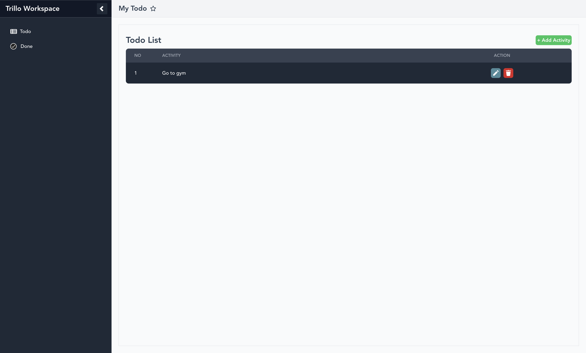

# ToDoList-Vue



ToDoList-Vue is a simple and responsive task management application built with Vue.js. This app allows users to add, edit, and delete tasks. Task data is stored using Firebase as the backend.

## Features

- Add Task: Users can add new tasks.
- Edit Task: Users can edit existing tasks.
- Delete Task: Users can delete tasks that are no longer needed.
- Firebase Integration: Task data is stored in real-time using Firebase.

## How to install on local
Follow these steps to run this project on your local:

1. Clone the repository:

```bash 
git clone https://github.com/jundihn/ToDoList-Vue.git
```

2. Go to the folder

```bash
cd ToDoList-Vue 
cd client
```

3. Install packages

```bash
npm install
```

4. Configure Firebase:
- Create a ".env" file
- Add the Firebase credentials to .env file

```bash
VUE_APP_FIREBASE_API_KEY=<api_key>
VUE_APP_FIREBASE_AUTH_DOMAIN=<auth_domain>
VUE_APP_FIREBASE_PROJECT_ID=<project_id>
VUE_APP_FIREBASE_STORAGE_BUCKET=<storage_bucket>
VUE_APP_FIREBASE_MESSAGING_SENDER_ID=<messaging_sender_id>
VUE_APP_FIREBASE_APP_ID=<app_id>
VUE_APP_FIREBASE_MEASUREMENT_ID=<measurement_id>
```

5. Run the application:

```bash
npm run serve
```

## Technologies Used

- Vue.js: A progressive JavaScript framework for building user interfaces.
- Firebase: A Backend as a Service providing real-time database and hosting services.

## Contributing
Contributions are welcome! If you would like to contribute, you can:

1. Fork this repository.
2. Create a new feature branch (git checkout -b feature/feature-name).
3. Commit your changes (git commit -m 'Add feature X').
4. Push to the branch (git push origin feature/feature-name).
5. Create a pull request.

## Contact
If you have any questions or suggestions, feel free to contact me at jundihn@gmail.com.